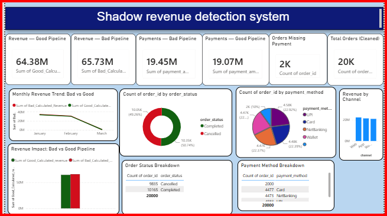

# Shadow Revenue Detection System

Quantifies the dollar cost of poor data engineering by building two parallel PySpark pipelines — a naive ("bad") pipeline and a cleaned, deduplicated ("good") pipeline — on the same retail dataset, then measuring the gap between them.

**Key finding: the bad pipeline overstates revenue by ~2.05% (₹65.73M vs ₹64.38M) — entirely due to 400 duplicate order records that were never deduplicated.**

---

## 🎯 What This Project Does

Retail companies often lose visibility into "shadow revenue" — money that looks real in dashboards but is actually inflated by duplicate records, orphaned payments, and inconsistent joins. This project simulates that scenario end-to-end:

1. Ingests raw retail data (orders, payments, products, customers) into a **Medallion architecture** (Bronze → Silver → Gold)
2. Builds **two versions** of the Silver/Gold layers side by side — one naive, one properly cleaned
3. Quantifies exactly how much the naive version's data-quality gaps cost in dollar terms
4. Visualizes the comparison in an interactive Power BI dashboard

---

## 📊 Key Results

| Metric | Bad Pipeline | Good Pipeline | Gap |
|---|---:|---:|---:|
| Total Revenue | ₹65,730,543.18 | ₹64,379,883.98 | **2.05%** |
| Total Payments | ₹19,450,610.20 | ₹19,067,003.96 | **1.97%** |
| Order Count | 20,400 | 20,000 | 400 duplicates |
| Missing Payments | — | 2,000 orders | — |
| Orphan Payments | — | 600 records | — |

The entire revenue gap traces back to **400 duplicate `order_id`s (800 rows)** in the raw data that the bad pipeline never deduplicated.

---

## 🏗️ Architecture

```
Raw CSVs (orders, payments, products, customers)
        │
        ▼
   BRONZE  (raw ingestion → Delta tables, ADLS Gen2)
        │
        ▼
   SILVER  (two parallel tracks)
   ├── Bad:  pass-through views, no cleaning
   └── Good: deduplicated (row_number/window), type-cast,
             SCD Type 2 filtering on products
        │
        ▼
    GOLD   (fact_revenue_bad, fact_revenue_good)
        │
        ▼
  Power BI (via ADLS Gen2 connector, Gold CSV exports)
```

**Stack:** Azure Databricks (PySpark) · Azure Data Lake Storage Gen2 · Power BI Desktop

---

## 🧠 Engineering Decisions Worth Noting

These are the parts of the project that go beyond "just running a tutorial":

**1. Unity Catalog blocked external table registration**
The Databricks workspace has Unity Catalog enabled, which blocks `CREATE TABLE ... USING DELTA LOCATION` for external ADLS paths without an Access Connector (out of scope for this project's timeline). **Workaround:** Gold DataFrames are exported as single CSVs (`.coalesce(1).write.csv(...)`) and loaded directly into Power BI via the ADLS Gen2 connector, bypassing the metastore entirely.

**2. Price-matching required a tolerance band, not exact match**
Initial analysis showed `price` has **zero relationship** to `catalog_price` or `discount` in this dataset — an exact-match rule flagged ~100% of orders as "mismatched," which is meaningless as a signal. Switched to a **>5% deviation tolerance band** to surface genuinely anomalous pricing instead.

**3. Deduplication via `row_number()` window function**
Used `row_number() OVER (PARTITION BY order_id ORDER BY order_date DESC)` rather than a blind `DISTINCT`, ensuring the *most recent* record per order is kept — a decision that matters when duplicates aren't identical rows.

**4. Handling ~49% Cancelled orders**
Nearly half of all orders carry `order_status = 'Cancelled'`. 
---

## 📁 Repo Structure

```
shadow-revenue-detection/
├── notebooks/          → PySpark pipeline (Bronze/Silver/Gold)
├── dashboard/           → Power BI file + screenshot
├── data_sample/         → Sample of raw orders.csv for reference
└── README.md
```

---

## 🚀 How to Reproduce

1. Provision Azure Databricks + ADLS Gen2 with three containers: `bronze`, `silver`, `gold`
2. Upload raw CSVs (`orders.csv`, `payments.csv`, `products.csv`, `customers.csv`) to `bronze`
3. Run notebooks in order: `01_bronze_ingestion` → `02_silver_cleansing` → `03_gold_analytics`
4. Open `dashboard/Revenue.pbix` in Power BI Desktop and point the ADLS Gen2 connector at your `gold` container

---

## 📈 Dashboard



KPI cards for Bad vs Good revenue/payments, a monthly revenue trend line, order-status and payment-method breakdowns, and a revenue-by-channel comparison — all built directly from the Gold-layer exports.
